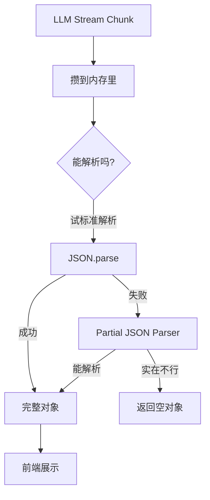

# LLM 流式输出的增量解析实战

最近在做 LLM 应用时，遇到一个挺有意思的问题：**流式输出的实时解析**。

你知道的，LLM 吐字是慢慢来的，一个 chunk 接一个 chunk。但问题是，有些数据（比如工具调用的 JSON 参数）必须等完整了才能用。怎么在数据没来全之前，尽可能实时地展示给用户？这就是这篇博客要聊的。

---

## 一、核心问题：三种数据，三种命

先说结论，不同类型的数据，处理方式完全不一样：

| 数据类型 | 典型场景 | 挑战 | 怎么办 |
| :--- | :--- | :--- | :--- |
| **结构化数据** | 工具调用参数 | JSON 语法严格，缺个引号就崩 | 缓冲 + 容错解析 |
| **非结构化文本** | 普通对话 | 协议不一致，但无所谓 | 直接转发 |
| **半结构化文本** | 思维链 | 夹在对话里，要分离 | 状态机 / 标签检测 |

为啥要分这么细？因为每种数据的"实时性要求"不一样。

**普通文本**：用户打字就是线性的，来一点显示一点，没毛病。

**工具调用**：你想想，如果 LLM 在说"我要调用工具，参数是..."，参数还没说完你就把半个 JSON 发给前端，前端直接报错，用户体验就炸了。

**思维链**：这个更蛋疼，有些模型会把思考过程混在正文里，你得自己扒拉出来。

---

## 二、结构化数据：Buffer + 容错解析

工具调用的场景最典型。LLM 输出 `{"path": "/src/main.py"}`，但不是一个 chunk 发完，可能是：

```
Chunk 1: {"path": "/src/ma
Chunk 2: in.py"}
```

### 1. 核心思路：先攒着，再试

处理流程长这样：



### 2. 举个例子

假设目标是 `{"key": "value"}`，数据是这么来的：

| 时间 | Buffer 里有什么 | 解析出来 | UI 显示 |
| :--- | :--- | :--- | :--- |
| T1 | `{"k` | `{}` | 啥也没有 |
| T2 | `{"key": "` | `{"key": ""}` | **自动补全**了空字符串 |
| T3 | `{"key": "val` | `{"key": "val"}` | 实时更新 |
| T4 | `{"key": "value"}` | `{"key": "value"}` | 完美收工 |

注意看 T2，虽然 LLM 还没输出完，但 Parser 很聪明，知道"这是个字符串，只是还没写完"，于是返回一个空字符串占位。这就是 **Partial JSON Parser** 的魔力。

### 3. 用什么库？

- **Node.js**: `partial-json` 或 `best-effort-json-parser`
- **Python**: `jiter`（Rust 写的，超快）或 `partial_json_parser`

别自己造轮子，这些库都踩过坑了。

---

## 三、非结构化文本：直接转发

普通对话就简单多了。

OpenAI 的流用 `delta.content`，Anthropic 用 `delta.text`，Google 又换个名字...但本质都是纯文本。

**策略：无脑转发**

收到 chunk → 提取文本 → 发给前端 → 前端 Append

不需要 Buffer，不需要解析，人类阅读本来就是线性的。

### 特殊情况：思维链 (Thinking)

有些模型（DeepSeek R1、Claude 3.7）会输出思考过程。这玩意儿有两种处理方式：

**情况 A：API 原生支持**

OpenAI 和 DeepSeek 会给 `reasoning_content`，Anthropic 给 `thinking` 字段。这种最好办，直接映射成内部事件 `thinking_delta`，前端渲染到折叠面板里就行。

**情况 B：标签混输**

有些模型不老实，把思考过程包在 `<thinking>...</thinking>` 标签里，混在正文里输出。这种就得用**状态机**了：

```python
buffer = ""
state = "NORMAL"

def on_chunk(chunk):
    global buffer, state
    buffer += chunk

    if state == "NORMAL" and "<thinking>" in buffer:
        pre, post = buffer.split("<thinking>", 1)
        emit("text_delta", pre)  # 先把之前的文本发出去
        state = "THINKING"
        buffer = post

    elif state == "THINKING" and "</thinking>" in buffer:
        thought, post = buffer.split("</thinking>", 1)
        emit("thinking_delta", thought)  # 思考过程
        state = "NORMAL"
        buffer = post

    # 其他情况继续攒着...
```

注意 `split(..., 1)`，这个参数很重要，防止内容里有多个标签被拆烂。

---

## 四、工程踩坑：理论很美好，现实很骨感

前面说的是理想情况，真实落地时会遇到一堆坑。

### 坑 1：Buffer 爆炸

**场景 A**：LLM 抽风了，开始复读机，一直不输出闭合的 `}`，Buffer 越攒越大，内存直接爆炸。

**场景 B**：网络断了，模型卡住，Buffer 一直挂在那儿吃内存。

**怎么办？**

1. **硬限制**：Buffer 超过 1MB 直接扔掉。工具调用参数哪有 1MB 的？肯定是模型抽风了。
2. **超时清空**：如果一个 Buffer 30 秒没更新也没闭合，强制清空，当没这回事。
3. **栈溢出保护**：`try-catch` 包起来，Parser 崩了不能把整个服务拖垮。

### 坑 2：嵌套字符串里的陷阱

**经典案例**：

```json
{"code": "console.log(\"Hello}\")"}
```

如果你用简单的正则匹配，看到第一个 `}` 就以为 JSON 结束了，解析出来的是：

```json
{"code": "console.log(\"Hello"}
```

这就尴尬了。

**正解**：用**状态机 Parser**。真正的 Parser 知道自己当前在"字符串内"，所以看到 `}` 会忽略，等遇到真正的结束括号。

前面推荐的那些库（`jiter`、`best-effort-json-parser`）都是基于状态机的，别用正则硬刚。

**还有个细节：转义字符**

LLM 输出 Chunk 1: `{"msg": "Hello \`
LLM 输出 Chunk 2: `nWorld"}`

如果在 Chunk 1 结束时解析，`JSON.parse('{"msg": "Hello \')` 会报错（字符串没结束）。好的 Parser 会看到末尾的 `\`，知道"这是转义序列的前半截，再等等"。

### 坑 3：模型自作聪明加 Markdown

很多开源模型（尤其是 LLaMA 系列）喜欢把 JSON 包在代码块里：

```
```json
{"path": "/src/main.py"}
```
```

如果你直接丢给 Parser，肯定报错。

**解决办法**：预处理一下

```javascript
buffer
  .replace(/^```json\s*/, "")  // 去掉开头的 ```json
  .replace(/```$/, "")          // 去掉结尾的 ```
```

或者更通用一点，用正则 `^```\w*\s*` 和结尾的 ` ``` ` 全部干掉。

---

## 五、架构总结

说人话版：

1. **收到 Chunk** → 判断类型（Text / Thinking / Tool）
2. **Text** → 直接转发给前端
3. **Tool** → 扔进 Buffer，调 `partial_json`，解析出来就发给前端
4. **Thinking** → 看运气：API 支持就直接用，不支持就自己扒标签

**三不原则**：

- 不用正则解析 JSON
- 不让 Buffer 无限增长
- 不相信模型会输出标准格式（总得清洗一下）

---

## 附录：工具箱

### 推荐库

| 语言 | 库名 | 特点 |
|------|------|------|
| **Python** | `jiter` | Rust 写的，超快，支持 partial |
| **Python** | `partial_json_parser` | 纯 Python，兼容性好 |
| **Node.js** | `best-effort-json-parser` | 容错能力强 |
| **Node.js** | `partial-json` | 轻量级 |

### 完整示例（Node.js）

```javascript
import { parse } from 'partial-json'

let toolBuffer = ''

function onStreamChunk(chunk) {
  // 假设 chunk.delta.tool_calls 是 OpenAI 格式
  if (chunk.delta.tool_calls) {
    for (const call of chunk.delta.tool_calls) {
      if (call.function.arguments) {
        toolBuffer += call.function.arguments

        try {
          const parsed = parse(toolBuffer)
          // 解析成功，发给前端
          emit('tool_update', {
            id: call.id,
            name: call.function.name,
            arguments: parsed
          })
        } catch (e) {
          // 解析失败，继续攒着
        }
      }
    }
  }

  // 普通文本直接转发
  if (chunk.delta.content) {
    emit('text_delta', chunk.delta.content)
  }
}
```

### 关键参数建议

| 参数 | 推荐值 | 理由 |
|------|--------|------|
| **Max Buffer Size** | 100KB - 1MB | 工具调用参数一般不超过 10KB |
| **Buffer TTL** | 30 秒 | 超过这个时间没更新，肯定是挂了 |
| **Text Threshold** | 4KB | 思考标签检测的阈值，太大前端会卡 |

---

## 写在最后

流式解析这事儿，说难不难，说简单也不简单。核心就是一句话：**别太相信模型会乖乖输出标准格式**。

加 Buffer、加容错、加超时保护，基本上就能覆盖 99% 的情况了。剩下的 1%，那就是模型真的抽风了，你也没办法。

祝你的 LLM 应用永远不崩 🎉
